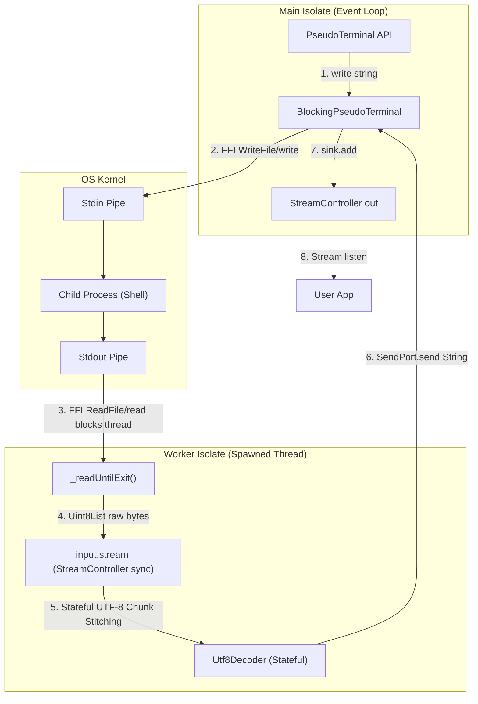
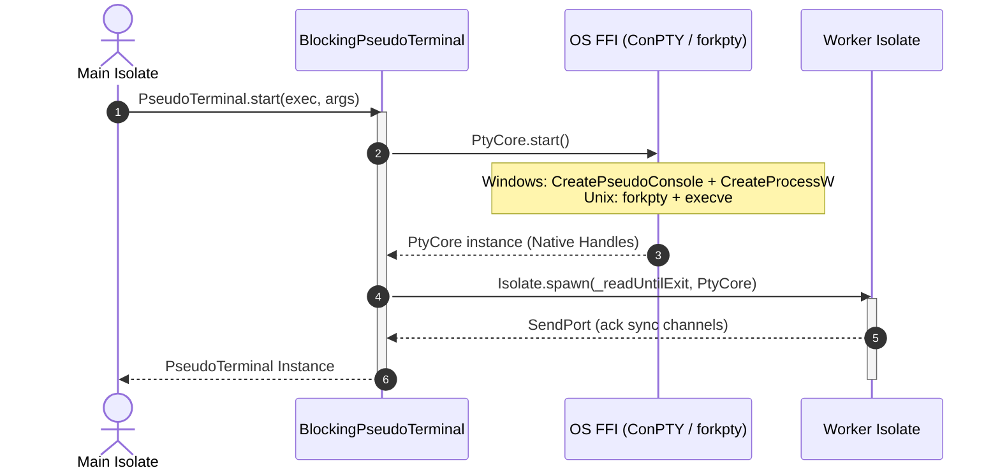
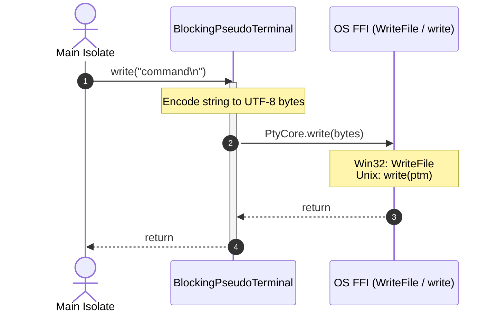
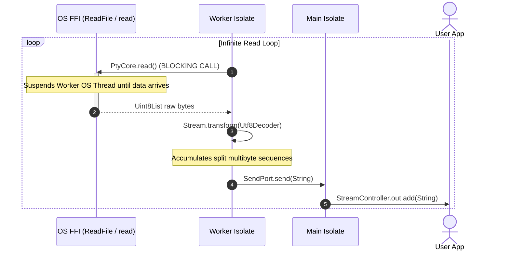
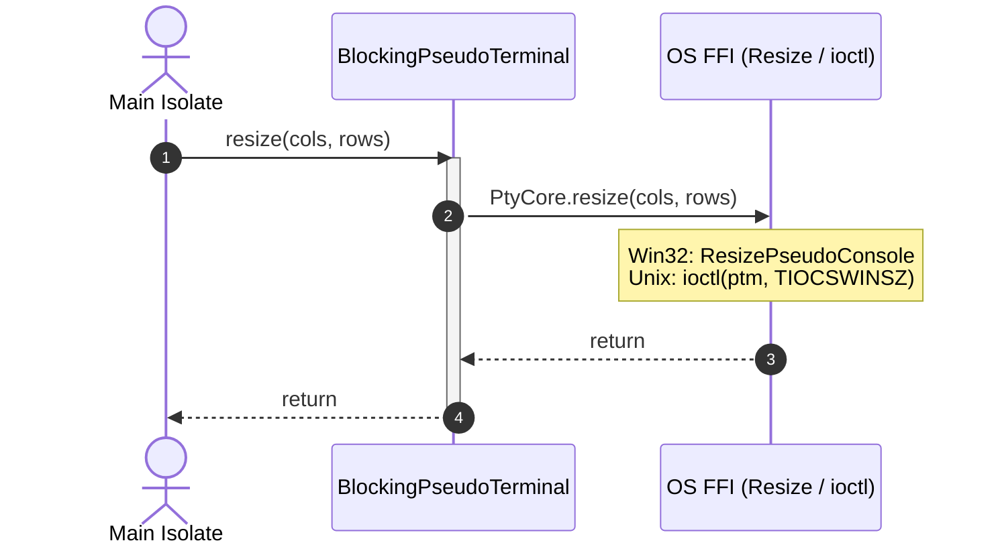
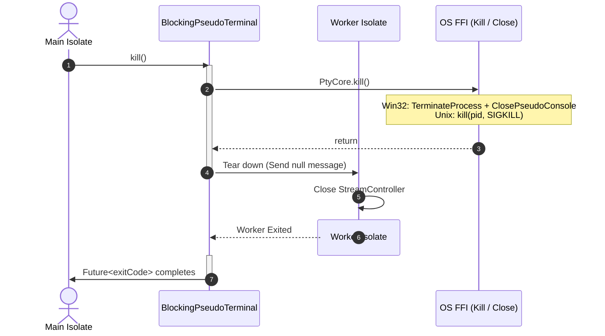

# `package:pty2` System Architecture

## 1. System Design Overview
`package:pty2` manages pseudo-terminal (PTY) lifecycles by wrapping native OS system calls via Dart FFI. To prevent blocking the main Dart isolate's single-threaded event loop during synchronous native I/O, it splits execution into a **Controller Isolate** (Main thread) and a **Worker Isolate** (Read Thread).

---

## 2. Sequence Diagrams

### 2.1 PTY Open (`PseudoTerminal.start`)
Sets up FFI structures, pipes, spawns the child process inside the PTY container, and spins up the worker isolate.

### 2.2 PTY Send (`write`)
Synchronously encodes characters to UTF-8 and passes them directly to the input write pipe via FFI on the main isolate.

### 2.3 PTY Read
The worker isolate blocks on the output read side of the OS pipe. When data is available, it decodes it statefully (safeguarding split UTF-8 multi-byte sequences) and dispatches it asynchronously to the main isolate.

### 2.4 PTY Resize
Changes physical width and height dimensions of the virtual console buffer.

### 2.5 PTY Close (`kill` / `exit`)
Terminates the spawned process, closes native handles, and tears down the isolates.

